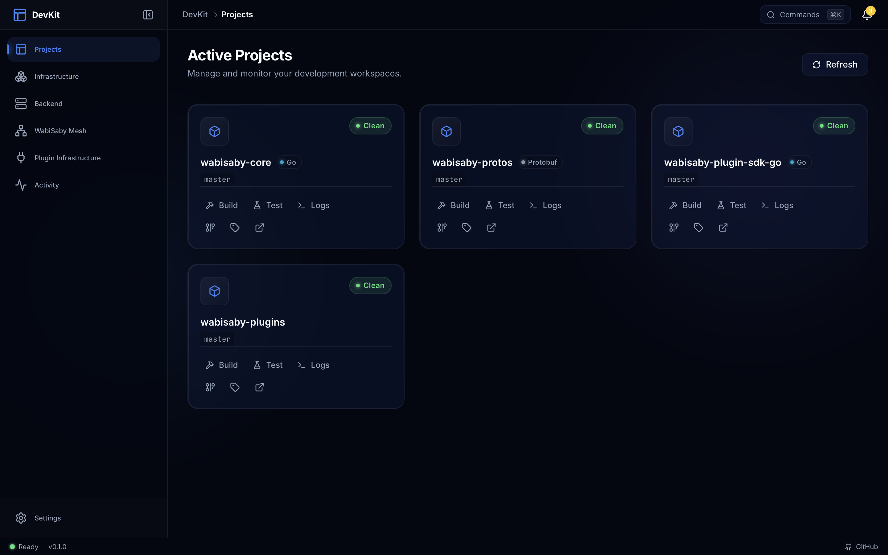

# WabiSaby DevKit

**Meta-repository and desktop app for WabiSaby platform development.** The DevKit app (built with [Wails](https://wails.io)) lets you manage WabiSaby projects, run services, and work with the local stack—either as a standalone tool or from this repo with all projects as git submodules.



## Features

- **Projects** — Add, clone, and manage WabiSaby projects (core, protos, plugin SDK, plugins); start/stop and stream logs.
- **Infrastructure** — View and manage Docker services (Postgres, Redis, MinIO, Vault, pgAdmin).
- **Services** — Run and monitor WabiSaby backend services from the app.
- **Activity** — Live activity and logs.
- **Settings** — Configure projects directory and app preferences.

## Repository structure

```
WabiSaby-DevKit/
├── .gitmodules              # Submodule configuration
├── LICENSE
├── README.md
├── Makefile                 # Repo-level commands (app, docker, cross-project)
├── app/                     # DevKit desktop app (Wails + Go + React)
│   ├── frontend/            # UI (Vite, React, SCSS)
│   ├── internal/            # App logic (config, git, services)
│   └── main.go
├── docs/
│   └── assets/              # Screenshots and docs assets
├── projects/                # Git submodules
│   ├── wabisaby-core/       # Main Go backend
│   ├── wabisaby-protos/     # Protocol buffer definitions
│   ├── wabisaby-plugin-sdk-go/
│   └── wabisaby-plugins/
├── scripts/                 # Cross-project scripts (test, build, format, submodules)
└── docker/                  # Docker Compose for local services
```

## Two ways to use DevKit

### 1. Using the DevKit app (end users)

Install or build the **DevKit desktop app** and use it to manage your WabiSaby projects and services. You choose where projects live (e.g. a folder of clones); you do **not** need to clone this meta-repo.

- **Build from source:** see [Building the app](#building-the-app).
- Projects and config are stored in app data, or a path you set via **Settings** (e.g. `WABISABY_PROJECTS_DIR`).

### 2. Developing DevKit or the platform (contributors)

Clone this repo and work with all projects in one tree. Submodules live under `projects/`. Use the root Makefile and scripts to run the app, run tests/builds across projects, and manage submodules.

## Prerequisites

- **Go** 1.22.x (toolchain go1.22.4 is used for Wails; see `app/go.mod`).
- **Node.js** and **npm** (for frontend dev; required for `make start`).
- **Wails v2** — install from [wails.io](https://wails.io/docs/gettingstarted/installation).
- **Docker** (optional) — for local Postgres, Redis, MinIO, Vault, pgAdmin.
- **Git** — for cloning and submodules.

## Quick start (contributors)

```bash
git clone <devkit-repo-url> && cd WabiSaby-DevKit
git submodule update --init --recursive
make setup    # optional: check deps, init submodules, go mod download
make start    # run DevKit app in dev mode (Wails + Vite)
```

To point the app at this repo’s `projects/` folder, set `WABISABY_DEVKIT_ROOT` to the DevKit repo root (and optionally `WABISABY_PROJECTS_DIR` to `projects`).

## Commands

| Command | Description |
|--------|-------------|
| `make start` | Run DevKit app (Wails dev mode, live reload) |
| `make app-build` | Build DevKit desktop binary |
| `make status` | Submodule status |
| `make update` | Update all submodules to latest |
| `make sync` | Record submodule commits in DevKit |
| `make test` | Run tests in all projects |
| `make build` | Build all projects |
| `make format` | Format code in all projects |
| `make lint` | Lint all projects |
| `make docker-up` | Start Docker services |
| `make docker-down` | Stop Docker services |
| `make docker-status` | Show Docker service status |
| `make clean` | Remove build artifacts |

## Building the app

From the repo root:

```bash
make app-build
# or
make -C app build
```

The binary is produced under `app/build/bin/` (platform-specific). For live-reload development, use `make start` (runs `make -C app dev`).

## Paths and submodules

- Submodules live under **`projects/<name>`** (see `.gitmodules`). Scripts assume this layout.
- Projects like `wabisaby-core` use `go.mod` replace directives that assume the DevKit layout when developing from this repo.
- To use this repo’s projects in the app: set `WABISABY_DEVKIT_ROOT` to the DevKit repo root and, if needed, `WABISABY_PROJECTS_DIR` to `projects`.

## Docker services

Local development stack: **Postgres**, **Redis**, **MinIO**, **Vault**, **pgAdmin**. Default credentials are for **local use only**; do not use in production.

```bash
make docker-up
make docker-status
make docker-down
```

## Contributing

1. Make changes in the right project under `projects/` (or in `app/` for the DevKit app).
2. Commit and push in the individual project repo.
3. If you changed a submodule, update DevKit to point at the new commit:  
   `git add projects/<name>` then commit in this repo.

## License

MIT. See [LICENSE](LICENSE).
