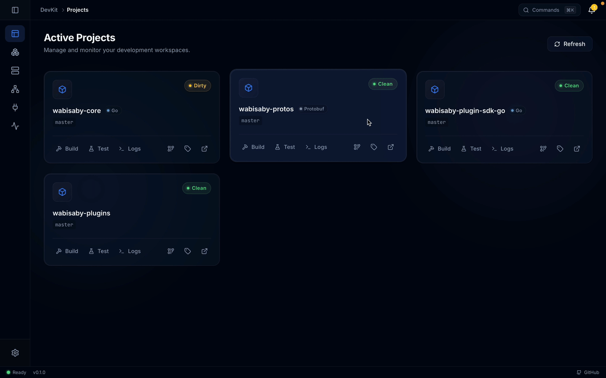
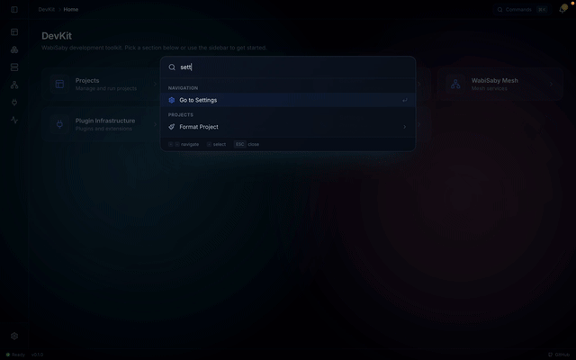

<div align="center">

# WabiSaby DevKit

**The all-in-one desktop companion for WabiSaby platform development.**

Manage projects, orchestrate services, stream logs, and control your entire local stack — all from a single app.

[](LICENSE)
[](https://go.dev)
[](https://wails.io)
[](https://react.dev)
[]()

<br />


</div>

<br />

## Features

### Project Management

Clone, build, test, and monitor all WabiSaby repositories from a unified dashboard. See git status at a glance, manage branches and tags, view dependency graphs, and open any project in your editor with one click.

<div align="center">



</div>

---

### Infrastructure Control

Start and stop Docker services — Postgres, Redis, MinIO, Vault, Keycloak, pgAdmin — individually or all at once. Stream container logs in real-time and jump to service UIs directly from the app.

<div align="center">


</div>

---

### Backend Services

Run, monitor, and health-check WabiSaby backend services (API, WebSocket, Mesh, Plugins). Group-start entire service sets, stream live logs, and manage database migrations — all without leaving the app.

<div align="center">


</div>

---

### Command Palette

Hit `⌘K` / `Ctrl+K` to open the command palette. Fuzzy-search through every action in the app — start a service, open a project, toggle settings — without touching the mouse.

<div align="center">


</div>

---

### Live Activity Feed

A real-time activity stream that captures everything happening across projects and services. Filter, search, and trace issues as they happen.

<div align="center">


</div>

---

### Settings & Environment

Configure project paths, validate prerequisites (Go, Node, Docker, Wails), manage environment variables with sensitive-value masking, and keep submodules in sync.

<div align="center">



</div>

---

<br />

## Tech Stack

| Layer | Technology |
|-------|-----------|
| **Desktop framework** | [Wails v2](https://wails.io) — Go + WebView |
| **Backend** | Go 1.22 |
| **Frontend** | React 19, Vite 7, SCSS |
| **Animations** | Framer Motion |
| **Icons** | Lucide React |
| **Infrastructure** | Docker Compose (Postgres 16, Redis 7, MinIO, Vault, Keycloak, pgAdmin) |

<br />

## Two Ways to Use DevKit

### As an end user

Install or build the **DevKit desktop app** and use it to manage your WabiSaby projects and services. You choose where projects live; you do **not** need to clone this meta-repo.

- **Build from source:** see [Building the app](#building-the-app).
- Projects and config are stored in app data, or a path you set via **Settings**.

### As a contributor

Clone this repo and work with all projects in one tree. Submodules live under `projects/`. Use the root Makefile and scripts to run the app, run tests and builds across projects, and manage submodules.

<br />

## Prerequisites

- **Go** 1.22+ &ensp;·&ensp; **Node.js** + **npm** &ensp;·&ensp; **Git**
- [**Wails v2**](https://wails.io/docs/gettingstarted/installation) — desktop framework
- **Docker** (optional) — for local infrastructure services

<br />

## Quick Start

```bash
# Clone with submodules
git clone https://github.com/WabiSaby/wabisaby-devkit.git && cd wabisaby-devkit
git submodule update --init --recursive

# Setup and run
make setup    # check deps, init submodules, go mod download
make start    # run DevKit app in dev mode (Wails + Vite hot-reload)
```

> **Tip:** To point the app at the repo's `projects/` folder, set `WABISABY_DEVKIT_ROOT` to the repo root directory.

<br />

## Commands

| Command | Description |
|---------|-------------|
| `make start` | Run DevKit app in dev mode (live reload) |
| `make app-build` | Build DevKit desktop binary |
| `make status` | Show submodule status |
| `make update` | Update all submodules to latest |
| `make sync` | Record submodule commits in DevKit |
| `make test` | Run tests across all projects |
| `make build` | Build all projects |
| `make format` | Format code across all projects |
| `make lint` | Lint all projects |
| `make docker-up` | Start Docker infrastructure services |
| `make docker-down` | Stop Docker infrastructure services |
| `make docker-status` | Show Docker service status |
| `make clean` | Remove build artifacts |

<br />

## Building the App

```bash
make app-build
# → Binary output: app/build/bin/ (platform-specific)
```

## Releasing

1. **Bump version** (if needed): update `Version` in `app/main.go`, `productVersion` in `app/wails.json`, and `version` in `app/frontend/package.json` to the new release (e.g. `0.1.0`).
2. **Commit and push** the version changes to `master`/`main`.
3. **Create and push the tag:**
   ```bash
   git tag -a v0.1.0 -m "Release v0.1.0"
   git push origin v0.1.0
   ```
4. **GitHub Actions** will run the [Release workflow](.github/workflows/release.yml): it builds the app for macOS (universal), Linux (amd64), and Windows (amd64), then creates a GitHub Release with the binaries attached.

For live-reload development, use `make start` instead.

### Dev mode: WebSocket hostname

When running in dev mode, the frontend connects to the Go backend over WebSocket. If you see a `wails.localhost` hostname error, add this to your hosts file:

```bash
# macOS / Linux
sudo sh -c 'echo "127.0.0.1 wails.localhost" >> /etc/hosts'
```

```powershell
# Windows (run as Administrator)
# Add "127.0.0.1 wails.localhost" to C:\Windows\System32\drivers\etc\hosts
```

Restart the DevKit app after changing hosts.

<br />

## Repository Structure

```
WabiSaby-DevKit/
├── app/                     # DevKit desktop app (Wails + Go + React)
│   ├── frontend/            #   UI — Vite, React, SCSS
│   ├── internal/            #   Backend logic — config, git, services
│   └── main.go              #   Wails entry point
├── projects/                # Git submodules
│   ├── wabisaby-core/       #   Main Go backend
│   ├── wabisaby-protos/     #   Protocol buffer definitions
│   ├── wabisaby-plugin-sdk-go/
│   └── wabisaby-plugins/
├── docker/                  # Docker Compose for local services
├── scripts/                 # Cross-project scripts (test, build, format)
├── docs/                    # Documentation and assets
├── Makefile                 # Top-level commands
└── .gitmodules              # Submodule configuration
```

<br />

## Contributing

1. Make changes in the appropriate project under `projects/` (or in `app/` for the DevKit app itself).
2. Commit and push in the individual project repo.
3. If you changed a submodule, update DevKit to point at the new commit:

```bash
git add projects/<name>
git commit -m "chore: update <name> submodule"
```

<br />

## License

MIT — see [LICENSE](LICENSE) for details.
